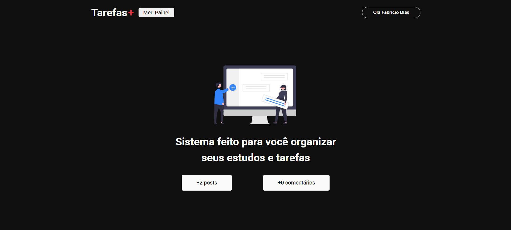
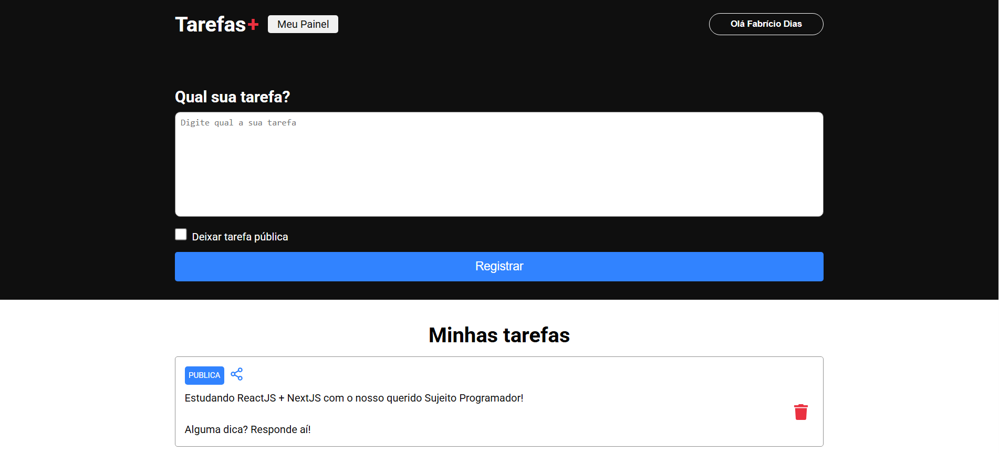
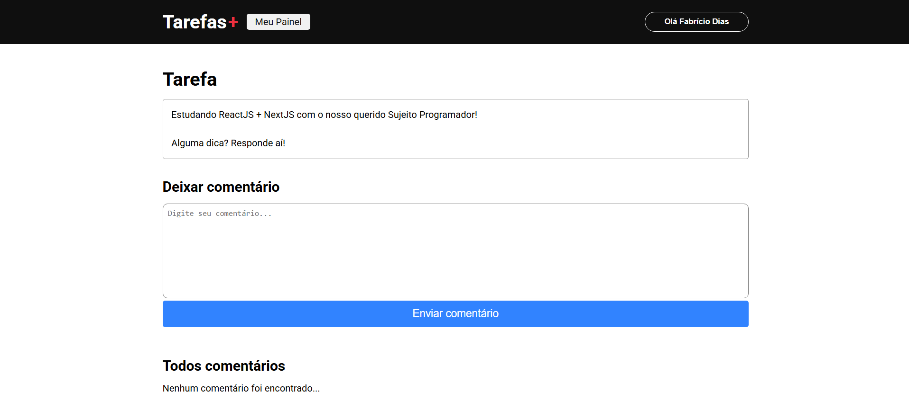

# Tarefas+ 📝

[](https://www.linkedin.com/in/fcdias0812)
[](mailto:fcdias0812@gmail.com)
[](https://github.com/fcdias0812/tarefasplus)

Tarefas+ é uma aplicação web moderna para gerenciamento de tarefas, desenvolvida com Next.js, Firebase e NextAuth. Permite aos usuários criar, compartilhar e gerenciar suas tarefas de forma eficiente.

## 📸 Imagens do Projeto

<div align="center">
  
  <p><i>Tela de home como SSG</i></p>
</div>

<div align="center">
  
  <p><i>Dashboard - Lista de tarefas e criação de novas tarefas</i></p>
</div>

<div align="center">
  
  <p><i>Página de detalhes da tarefa com sistema de comentários</i></p>
</div>

## ✨ Funcionalidades

- 🔐 Autenticação de usuários com NextAuth
- 📋 Criação e gerenciamento de tarefas
- 🌐 Compartilhamento de tarefas públicas
- 💬 Sistema de comentários em tarefas
- 🗑️ Exclusão de tarefas e comentários
- 📱 Interface responsiva e moderna

## 🚀 Tecnologias Utilizadas

- [Next.js](https://nextjs.org/) - Framework React para produção
- [TypeScript](https://www.typescriptlang.org/) - Superset JavaScript com tipagem estática
- [Firebase](https://firebase.google.com/) - Plataforma de desenvolvimento do Google
  - Firestore Database
  - Authentication
- [NextAuth.js](https://next-auth.js.org/) - Autenticação para Next.js
- [React Icons](https://react-icons.github.io/react-icons/) - Ícones para React
- [CSS Modules](https://github.com/css-modules/css-modules) - Estilização modular

## 📋 Pré-requisitos

- Node.js (versão 14 ou superior)
- npm ou yarn
- Conta no Firebase
- Conta no Google (para autenticação)

## 🔧 Instalação

1. Clone o repositório:

```bash
git clone https://github.com/fcdias0812/tarefasplus.git
cd tarefasplus
```

2. Instale as dependências:

```bash
npm install
# ou
yarn install
```

3. Configure as variáveis de ambiente:
   Crie um arquivo `.env.local` na raiz do projeto com as seguintes variáveis:

```env
NEXTAUTH_URL=http://localhost:3000
NEXTAUTH_SECRET=sua_chave_secreta
GOOGLE_ID=seu_google_client_id
GOOGLE_SECRET=seu_google_client_secret
NEXT_PUBLIC_URL=http://localhost:3000
```

4. Configure o Firebase:

- Crie um projeto no Firebase Console
- Ative o Authentication com Google
- Configure o Firestore Database
- Adicione as credenciais do Firebase ao projeto

5. Inicie o servidor de desenvolvimento:

```bash
npm run dev
# ou
yarn dev
```

## 🏗️ Estrutura do Projeto

```
src/
├── components/         # Componentes reutilizáveis
├── pages/             # Páginas da aplicação
│   ├── api/          # Rotas da API
│   ├── dashboard/    # Painel do usuário
│   └── task/         # Páginas de tarefas
├── services/         # Serviços (Firebase, etc)
└── styles/          # Estilos globais
```

## 🔑 Principais Funcionalidades

### Autenticação

- Login com Google
- Proteção de rotas
- Sessão persistente

### Dashboard

- Listagem de tarefas
- Criação de novas tarefas
- Opção de tornar tarefas públicas
- Compartilhamento de tarefas
- Exclusão de tarefas

### Tarefas

- Visualização detalhada
- Sistema de comentários
- Exclusão de comentários
- Interface responsiva

## 🛠️ Desenvolvimento

### Comandos Disponíveis

```bash
npm run dev     # Inicia o servidor de desenvolvimento
npm run build   # Cria a build de produção
npm run start   # Inicia o servidor de produção
npm run lint    # Executa o linter
```

### Padrões de Código

- TypeScript para tipagem estática
- CSS Modules para estilização
- Componentes funcionais com Hooks
- Server-side rendering com getServerSideProps

## 🔒 Segurança

- Autenticação via NextAuth
- Proteção de rotas
- Validação de dados
- Sanitização de inputs
- Regras de segurança no Firebase

## 🤝 Contribuindo

1. Faça um Fork do projeto
2. Crie uma Branch para sua Feature (`git checkout -b feature/AmazingFeature`)
3. Faça o Commit das suas mudanças (`git commit -m 'Add some AmazingFeature'`)
4. Faça o Push para a Branch (`git push origin feature/AmazingFeature`)
5. Abra um Pull Request

## 📝 Licença

Este projeto está sob a licença MIT. Veja o arquivo [LICENSE](LICENSE) para mais detalhes.
